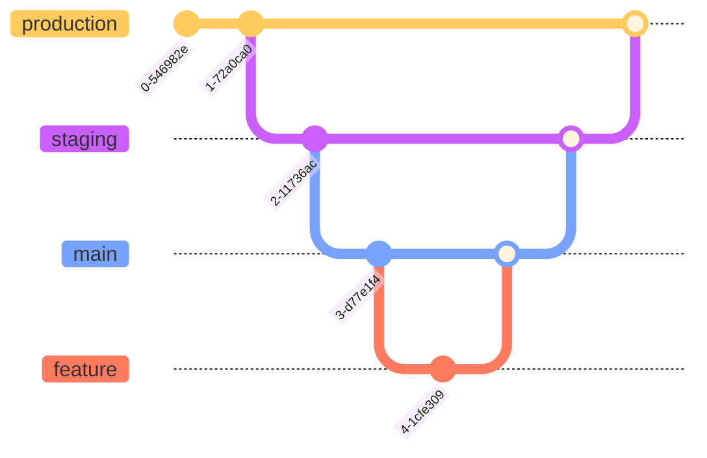
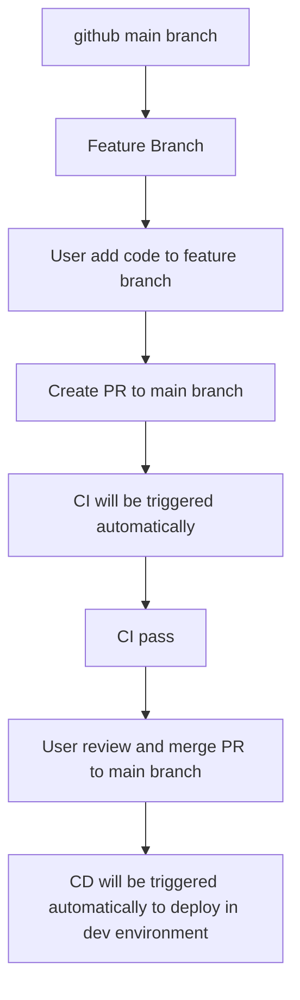
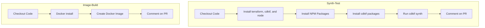
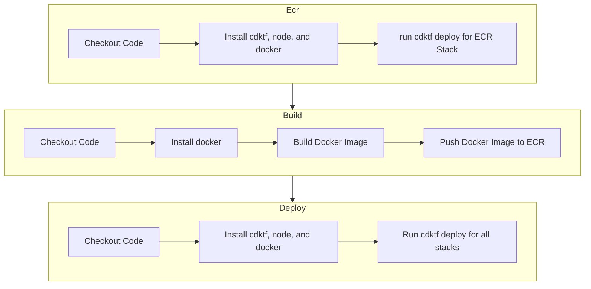

# tv-devops-assessment
## App
Local Setup -> [README.md](app/README.md#local-development-setup)

## Iaac
Local Setup -> [README.md](iaac/README.md#installation-and-usage-on-local-machine)

## CICD

### Files:
- `.github/workflows/ci.yaml`: CI pipeline for the application and IaaC.
- `.github/workflows/cd.yaml`: CD pipeline for the application and IaaC.

### Flow:
#### GitFlow

#### Triggers

#### CI

#### CD

### Installation
### Steps
- Create a S3 Bucket and DynamoDB Table for Terraform state management in your AWS account using aws CLI mentioned at [here](iaac/README.md#steps-to-run).
- Create three diifferent environments in Github Repo Settings:
  - `development`
  - `staging`
  - `production`
- Add your AWS credentials to GitHub secrets in each environment:
  - `AWS_ACCESS_KEY_ID`: Your AWS access key ID
  - `AWS_SECRET_ACCESS_KEY`: Your AWS secret access key
- Add below env variables in each environment:
  - `AWS_REGION`: e.g., `us-east-1`
  - `AWS_ECR_REPO_NAME`: Your ECR repository name as per the environment
- create a new branch from `main` and pull your changes in your machine
- update the `.env` files in the `iaac` directory with your specific values as mentioned [here](iaac/README.md#env-files) and push the changes to your branch
- create a pull request to merge your changes into the `main` branch
- once the pull request is created, the CI pipeline will be triggered automatically
- after the CI pipeline passes, you can merge the pull request into the `main` branch
- once the pull request is merged, the CD pipeline will be triggered automatically to deploy the application. Main branch will be deployed to the `development` environment, and you can promote it to `staging` and `production` environments by creating pull requests from `development` to `staging` and `staging` to `production`.