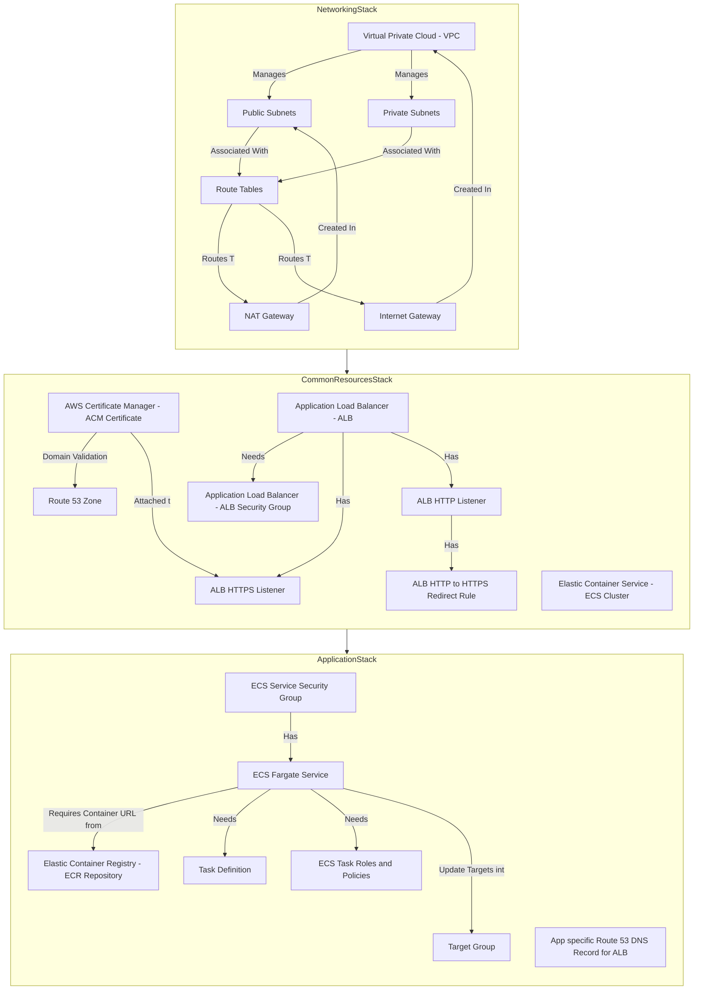

This document describes an Infrastructure as Code (IaaC) setup for deploying an application's AWS infrastructure using CDKTF (Cloud Development Kit for Terraform).

## IaaC for Application AWS Infrastructure

The infrastructure is organized into three main stacks to ensure modularity and clear dependencies:

  * **Networking Stack:** Sets up the foundational network components.
  * **Common Resources Stack:** Manages shared services and resources.
  * **Application Stack:** Defines and deploys the application-specific components.

These stacks are designed to be deployed in a specific order: Networking first, then Common Resources, and finally the Application Stack, as the latter stacks depend on resources created in the former.

### Stack and Resource Graphs

Here's a visual representation of the stacks and the resources within them:



### File Structure

The project files are organized as follows:

```
app-iaac/
├── main.ts               # Entry point for the CDKTF application. Initializes all stacks.
├── applicationStack.ts   # Defines the Application Stack.
├── commonResourceStack.ts # Defines the Common Resources Stack.
├── networkingStack.ts    # Defines the Networking Stack.
├── .env.development      # Environment variables for the development environment.
├── .env.staging          # Environment variables for the staging environment.
├── .env.production       # Environment variables for the production environment.
├── package.json          # Node.js project configuration.
├── tsconfig.json         # TypeScript configuration.
└── cdktf.json            # CDKTF configuration.
```

### Stack Descriptions

1.  **Networking Stack**:

      * Creates a Virtual Private Cloud (VPC) with dedicated public and private subnets.
      * Sets up a NAT Gateway (for private subnets to access the internet) and an Internet Gateway (for public subnets to access the internet).
      * Configures route tables to direct network traffic appropriately within the VPC.
      * Leverages the `terraform-aws-modules/vpc/aws` module for streamlined VPC management.

2.  **Common Resources Stack**:

      * Manages shared infrastructure components:
          * **ACM Certificates**: For SSL/TLS encryption.
          * **Route 53 Zones**: For DNS management.
          * **ECS Cluster**: The logical grouping for your containerized applications.
          * **Application Load Balancer (ALB)**: Distributes incoming application traffic across multiple targets.
      * Configures security groups for the ALB to control incoming and outgoing traffic.
      * Sets up an HTTPS listener on the ALB for secure communication and an HTTP listener with a redirection rule to automatically forward HTTP traffic to HTTPS.
      * Validates ACM certificates using DNS records within Route 53.

3.  **Application Stack**:

      * Defines the core of your application deployment:
          * **ECS Fargate Service**: Runs and scales your containerized application without managing servers.
          * **Task Definitions**: Blueprints for your application containers, specifying their images, CPU, memory, etc.
          * **ECR Repositories**: Stores your Docker container images.
          * **ECS Service Security Group**: Controls network access to your ECS services.
          * **Route 53 DNS Records**: Creates application-specific DNS records pointing to the ALB.

### .env Files

These files store environment-specific configurations:

  * `.env.development`: For the development environment.
  * `.env.staging`: For the staging environment.
  * `.env.production`: For the production environment.

Common environment variables found in these files include:

  * `PROJECT_NAME`: A unique identifier for your project.
  * `APP_ENV`: Specifies the deployment environment (e.g., `development`, `staging`, `production`).
  * `REMOTE_BACKEND_BUCKET_NAME`: The S3 bucket used for storing Terraform's state remotely.
  * `REMOTE_BACKEND_DYNAMODB_TABLE_NAME`: The DynamoDB table used for state locking to prevent concurrent modifications.
  * `ROUTE53_HOSTED_ZONE_NAME`: The Route 53 hosted zone where DNS records for your application will be managed.
  * `APP_PORT`: The port on which your application runs.
  * `APP_DOMAIN_NAME`: The domain name assigned to your application.

### Installation and Usage on Local Machine

#### Prerequisites

Before you begin, ensure you have the following installed:

  * **Node.js and npm**: For running JavaScript/TypeScript projects.
  * **AWS CLI**: To interact with your AWS account. Make sure it's configured with your credentials.
  * **cdktf CLI**: The command-line interface for CDKTF, installed globally.
  * **Terraform**: The underlying infrastructure as code tool.
  * **AWS account**: With sufficient permissions to create the necessary resources.
  * **Docker**: For building container images for your application.

#### Steps to Run

1.  **Install Dependencies**: Navigate to the `app-iaac/` directory and run:

    ```bash
    npm install
    cdktf get
    ```

    `npm install` installs all Node.js dependencies, and `cdktf get` generates the necessary Terraform providers and modules.

2.  **Configure Environment Variables**:
    Edit the `.env` files (e.g., `.env.development`) to set your specific environment variables. **Crucially, update `ROUTE53_HOSTED_ZONE_NAME` and `APP_DOMAIN_NAME`** to match your existing AWS Route 53 hosted zone and desired application domain. This IaaC assumes you have a Route 53 hosted zone already set up.

3.  **Configure AWS CLI**:
    Set up your AWS credentials for the AWS CLI:

    ```bash
    aws configure
    # Enter your AWS Access Key ID, Secret Access Key, region (e.g., us-east-1), and output format.
    ```

    If you use multiple AWS profiles, specify which one to use:

    ```bash
    export AWS_PROFILE=your-profile-name
    ```

4.  **Create Remote State Management Resources (if not already created)**:
    Create the S3 bucket and DynamoDB table for Terraform's remote state management. The names should match those defined in your `.env` files.

    ```bash
    aws s3 mb s3://project1-cdktf-state
    aws s3api put-bucket-versioning --bucket project1-cdktf-state --versioning-configuration Status=Enabled

    aws dynamodb create-table \
        --table-name project1-cdktf-lock \
        --attribute-definitions AttributeName=LockID,AttributeType=S \
        --key-schema AttributeName=LockID,KeyType=HASH \
        --provisioned-throughput ReadCapacityUnits=5,WriteCapacityUnits=5
    ```

5.  **Deploy the Infrastructure**:
    Specify the `APP_ENV` variable to indicate which environment you are deploying to (e.g., `development`, `staging`, `production`), then run:

    ```bash
    APP_ENV=development cdktf deploy Application Networking CommonResource
    ```

    This command will synthesize the Terraform code and then apply it to deploy the specified stacks in order.

6.  **Destroy the Infrastructure**:
    To remove the deployed infrastructure, use:

    ```bash
    APP_ENV=development cdktf destroy Application Networking CommonResource
    ```

7.  **List Stacks**:
    To see a list of available stacks:

    ```bash
    APP_ENV=development cdktf list
    ```

8.  **Synthesize Terraform Code**:
    To generate the Terraform `.tf.json` files without deploying:

    ```bash
    APP_ENV=development cdktf synth
    ```

9.  **Check Generated Terraform Code**:
    To view the planned changes before applying:

    ```bash
    APP_ENV=development cdktf diff <stack-name>
    ```

10. **Change Environment**:
    To deploy to a different environment (e.g., staging), first clear the `cdktf.out` directory (where synthesized Terraform code is stored), then change the `APP_ENV` variable and re-run the deploy command:

    ```bash
    rm -rf cdktf.out
    APP_ENV=staging cdktf deploy Application Networking CommonResource
    ```

### CI/CD (Continuous Integration/Continuous Deployment)

This project includes GitHub Actions workflows for automating CI/CD:

  * `.github/workflows/iaac-ci.yaml`: Configures the Continuous Integration (CI) pipeline. It runs on pull requests to build and test the IaaC code, including performing a `cdktf synth`.
  * `.github/workflows/iaac-cd.yaml`: Configures the Continuous Deployment (CD) pipeline. It runs on pushes to specific branches to deploy the IaaC code to AWS.

#### Steps for CI/CD Setup

1.  **Create GitHub Environments**:
    In your GitHub repository settings, create three environments:

      * `development`
      * `staging`
      * `production`

2.  **Add AWS Credentials to GitHub Secrets**:
    For each of the above GitHub environments, add the following secrets:

      * `AWS_ACCESS_KEY_ID`
      * `AWS_SECRET_ACCESS_KEY`

3.  **Add Environment Variables to GitHub Environments**:
    Also, for each GitHub environment, add the following environment variable:

      * `AWS_REGION`: e.g., `us-east-1`

4.  **Adjust Workflow File Paths (if necessary)**:
    If your IaaC files are **not** in an `iaac` folder at the root of your repository (as this example assumes), you'll need to modify the `paths` in the `on.push` and `on.pull_request` sections of both `.github/workflows/iaac-ci.yaml` and `.github/workflows/iaac-cd.yaml` files. If your IaaC is at the root, simply remove the `paths` section.

5.  **Push and Trigger Deployments**:

      * Push your changes to the `main` branch of your repository. This will trigger the CD pipeline for the `development` environment.
      * Create two more branches: `release/staging` and `release/production`. Push these branches to your repository. This will trigger the CD pipeline for the `staging` and `production` environments respectively.

6.  **Update Environment Variables for CI/CD**:
    Ensure the `.env.development`, `.env.staging`, and `.env.production` files within your `iaac` folder are correctly configured. They should follow the same structure as your local setup.

      * **Route 53**: Verify that `ROUTE53_HOSTED_ZONE_NAME` and `APP_DOMAIN_NAME` are updated to reflect your AWS account's Route 53 hosted zones.
      * **Remote State**: Confirm that `REMOTE_BACKEND_BUCKET_NAME` and `REMOTE_BACKEND_DYNAMODB_TABLE_NAME` match the S3 bucket and DynamoDB table you created for remote state management.