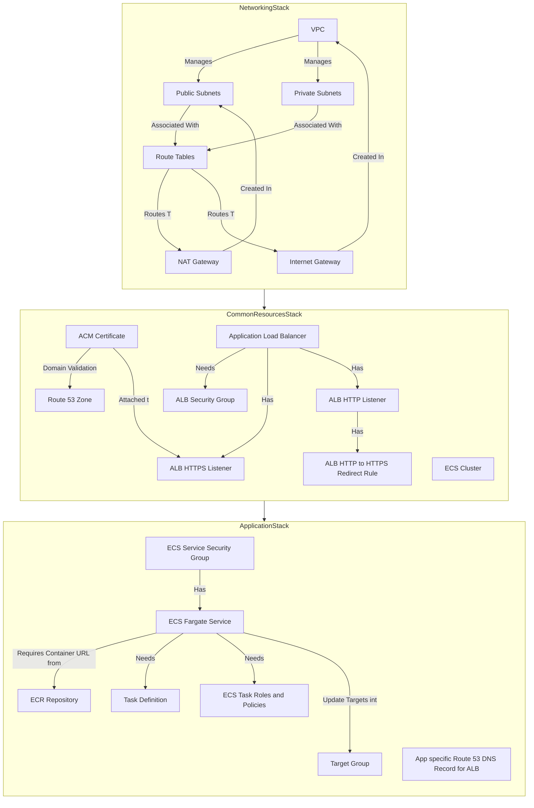

# IaaC for Application AWS Infrastructure
## Stack and Resource Graphs

## File Structure
```
app-iaac/
├── main.ts # Entry Point for CDKTF Application. Also initialise stacks.
├── applicationStack.ts # Application Stack Definition
├── commonResourceStack.ts # Common Resources Stack Definition
├── networkingStack.ts # Networking Stack Definition
├── .env.development # Environment Variables for Development
├── .env.staging # Environment Variables for Staging
├── .env.production # Environment Variables for Production
├── package.json
├── tsconfig.json
└── cdktf.json
```
## Stack Description
1. **Networking Stack**: 
   - Creates a VPC with public and private subnets.
   - Configures NAT Gateway and Internet Gateway.
   - Sets up route tables for routing traffic.
   - Uses the `terraform-aws-modules/vpc/aws` module for VPC management.
2. **Common Resources Stack**:
   - Manages common resources like ACM certificates, Route 53 zones, ECS clusters, and Application Load Balancers (ALB).
   - Configures security groups for the ALB and ECS services.
   - Sets up HTTPS listeners and HTTP to HTTPS redirection rules for the ALB.
   - Validates ACM certificates using DNS records in Route 53.
3. **Application Stack**:
   - Defines the ECS Fargate service and task definitions.
   - Manages ECR repositories for container images.
   - Configures security groups for the ECS service.
   - Sets up Route 53 DNS records for the application domain.

## .env Files
- **.env.development**: Contains environment variables for the development environment.
- **.env.staging**: Contains environment variables for the staging environment.
- **.env.production**: Contains environment variables for the production environment.

ENV variables include:
- `PROJECT_NAME`: Name of the project.
- `APP_ENV`: Environment name (development, staging, production).
- `REMOTE_BACKEND_BUCKET_NAME`: S3 bucket name for remote state storage.
- `REMOTE_BACKEND_DYNAMODB_TABLE_NAME`: DynamoDB table name for state locking.
- `ROUTE53_HOSTED_ZONE_NAME`: Route 53 hosted zone name for DNS management.
- `APP_PORT`: Port on which the application runs.
- `APP_DOMAIN_NAME`: Domain name for the application.

## Installation and Usage on Local Machine
### Prerequisites
- Node.js and npm installed.
- AWS CLI installed and configured with your credentials.
- cdktf CLI installed globally.
- Terraform installed.
- AWS account with permissions to create resources.
- Docker installed (for building container images).
### Steps to Run
1. **Install Dependencies**:
   ```bash
   npm install
   cdktf get
   ```
2. Edit the `.env` files to set your environment variables. Make sure to change Route53 Hosted Zone Name and application domain name as per your AWS account setup. This IaaC assumes you have a Route53 hosted zone already created. 
3. Configure AWS CLI with your credentials.
   ```bash
   aws configure
   # Enter your AWS Access Key ID, Secret Access Key, region, and output format.
   ```
   This code is using AWS default profile. If you have multiple profiles, you can set the `AWS_PROFILE` environment variable to specify which profile to use.
   ```bash
   export AWS_PROFILE=your-profile-name
   ```
4. Create S3Bucket and DynamoDB Table for remote state management if not already created. Bucket and table names should match those defined in your `.env` files.
    ```bash
    aws s3 mb s3://project1-cdktf-state
    aws s3api put-bucket-versioning --bucket project1-cdktf-state --versioning-configuration Status=Enabled

    aws dynamodb create-table \
        --table-name project1-cdktf-lock \
        --attribute-definitions AttributeName=LockID,AttributeType=S \
        --key-schema AttributeName=LockID,KeyType=HASH \
        --provisioned-throughput ReadCapacityUnits=5,WriteCapacityUnits=5
    ```
5. Deploy the infrastructure using cdktf. APP_ENV should be set to the environment you are deploying to (development, staging, production).
   ```bash
   APP_ENV=development cdktf deploy Application Networking CommonResource
   ```
6. To destroy the infrastructure, run:
   ```bash
   APP_ENV=development cdktf destroy Application Networking CommonResource
   ```
7. To list the stacks:
   ```bash
   APP_ENV=development cdktf list
   ```

8. To view the generated Terraform code:
   ```bash
   APP_ENV=development cdktf synth
   ```
9. To Check the generated Terraform code:
   ```bash
   APP_ENV=development cdktf diff <stack-name>
   ```
10. Want to change the environment? Just change the `APP_ENV` variable to `staging` or `production` and remove `cdktf.out` dir, and re-run the deploy command.
    ```bash
    rm -rf cdktf.out
    APP_ENV=staging cdktf deploy Application Networking CommonResource
    ```